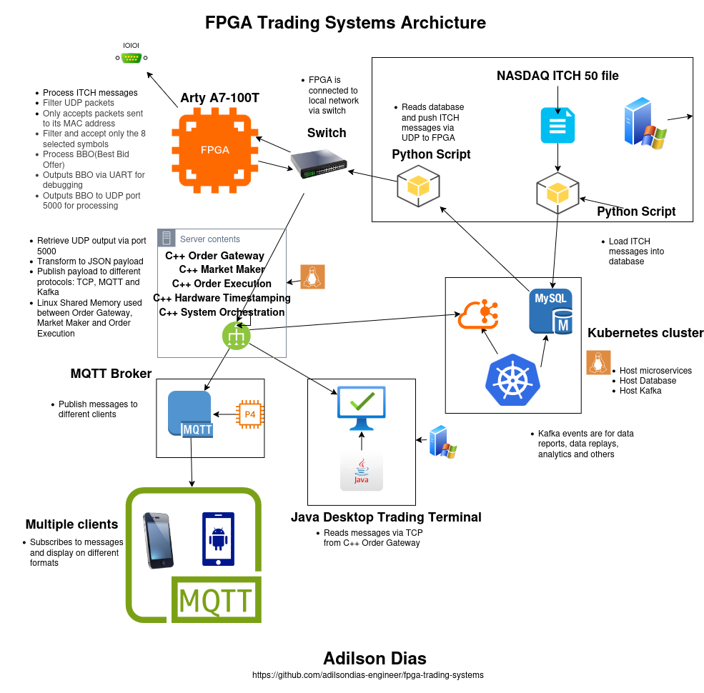

# FPGA Trading Systems

Hardware-accelerated market data processing and order book management for low-latency trading systems. Features NASDAQ ITCH 5.0 protocol parsing, hardware order book with sub-microsecond latency, and advanced clock domain crossing architecture.

## Profile

**Technical Background:**
- 20+ years C++ systems engineering (distributed systems, real-time processing, network protocols)
- 5 years active futures trading (S&P 500, Nasdaq 100)
- FPGA hardware acceleration specialist focusing on trading infrastructure

**Domain Expertise:** Combining software engineering experience with active trading knowledge to build FPGA-based market data systems and order management infrastructure.

## Hardware

- Xilinx Arty A7-100T Development Board
- Artix-7 FPGA (XC7A100T-1CSG324C)
- AMD Vivado Design Suite

## Technical Focus

Progressive architecture development from digital design fundamentals to production trading systems:

- **Low-latency network processing:** MII Ethernet, UDP/IP stack, NASDAQ ITCH 5.0 protocol
- **Memory architecture:** BRAM-based order storage, price level tables, FIFO buffering
- **Clock domain crossing:** Production-grade CDC with gray code synchronization
- **State machine design:** Multi-stage FSM pipelines for deterministic latency
- **Real-time processing:** Sub-microsecond order book updates, hardware BBO tracking
- **Timing analysis:** XDC constraints, setup/hold violations, critical path optimization

## Project Portfolio

### Core Trading Infrastructure (Projects 6-8)

**Project 06: UDP/IP Network Stack**
- **Achievement:** Production-grade Ethernet packet processing with 100% reliability under stress testing
- **Architecture:** MII physical layer, MAC frame parser, IP/UDP protocol stack
- **Key Innovation:** Real-time byte-by-byte parsing eliminates CDC race conditions (1% → 100% success rate)
- **Validation:** 1000+ packet stress test, comprehensive XDC timing constraints
- **Latency:** Wire-to-parsed < 2 μs @ 100 MHz processing clock

**Project 07: NASDAQ ITCH 5.0 Protocol Parser**
- **Achievement:** Full ITCH 5.0 market data decoder with 9 message types
- **Architecture:** Async FIFO with gray code CDC, configurable symbol filtering
- **Message Types:** S (System), R (Directory), A (Add), E (Execute), X (Cancel), D (Delete), U (Replace), P (Trade), Q (Cross)
- **Performance:** Deterministic message parsing, symbol filtering reduces downstream load
- **Integration:** Feeds parsed ITCH messages to Project 8 order book
- **Demo Video:** [docs/videos/live_historic_data_feed.mp4](docs/videos/live_historic_data_feed.mp4) - Python script feeding historic NASDAQ data to FPGA via UDP

**Project 08: Multi-Symbol Hardware Order Book** ✅
- **Achievement:** Sub-microsecond order book tracking 8 symbols simultaneously
- **Architecture:** 8 parallel BRAM-based order books with round-robin BBO arbiter
- **Symbols:** AAPL, TSLA, SPY, QQQ, GOOGL, MSFT, AMZN, NVDA
- **Capacity:** 1,024 orders × 256 price levels per symbol
- **Latency:** Order processing 120-170 ns, BBO update 2.6 μs per symbol
- **Resources:** 32 RAMB36 tiles (24% utilization), excellent scalability headroom
- **Spread Calculation:** Real-time ask - bid calculation for risk management
- **BRAM Implementation:** Production-grade Block RAM inference using Xilinx templates
- **Debug Methodology:** Comprehensive instrumentation for systematic troubleshooting
- **Trading Relevance:** Multi-symbol tracking essential for real-world exchange systems
- **BBO Output:** UART interface with symbol name, bid/ask prices/shares, spread, change detection

**Project 13: UDP BBO Transmitter (MII TX)** ✅
- **Achievement:** Real-time BBO distribution via UDP with sub-microsecond latency
- **Architecture:** BBO UDP formatter + SystemVerilog/VHDL mixed-language integration
- **Protocol:** UDP/IP transmission to 192.168.0.93:5000, broadcast MAC
- **Payload:** 256-byte UDP packets (28 bytes BBO data + 228 bytes padding)
- **Data Format:** Big-endian, fixed-point prices (4 decimal places), Symbol + Bid/Ask/Spread
- **Integration:** Frees UART for debug messages, UDP handles market data distribution
- **Language Interop:** eth_udp_send_wrapper.sv flattens SystemVerilog interfaces for VHDL instantiation
- **Timing Closure:** XDC constraints for clk_25mhz TX clock domain (eth_udp_send uses generated clock, not eth_tx_clk)
- **Pipelined Design:** 2-stage nibble formatter (CALC_NIBBLE → WRITE_NIBBLE) for timing optimization
- **Trading Relevance:** Low-latency UDP multicast essential for distributing BBO to trading algorithms
- **Parsing Support:** Python and C++ reference implementations for UDP packet decoding

### Application Layer (Projects 9-12, 14) ✅

**Project 09: C++ Order Gateway (UART)** ✅
- **Purpose:** Multi-protocol data distribution bridge (FPGA → Applications)
- **Architecture:** UART reader, BBO parser (hex→decimal), multi-protocol publisher
- **Protocols:** TCP Server (9999), MQTT Publisher (Mosquitto), Kafka Producer
- **Distribution:**
  - **TCP → Java Desktop** (low-latency trading terminal)
  - **MQTT → ESP32 IoT + Mobile App** (lightweight, mobile-friendly)
  - **Kafka → Future Analytics** (data persistence, replay, ML pipelines)
- **Technologies:** C++17, Boost.Asio, libmosquitto, librdkafka, nlohmann/json
- **Performance:** 10.67 μs avg parse latency, 6.32 μs P50
- **Limitation:** UART @ 115200 baud (replaced by UDP in Project 14)
- **Status:** Complete, superseded by Project 14 for production use

**Project 10: ESP32 IoT Live Ticker** ✅ **COMPLETE**
- **Purpose:** Physical trading floor display with MQTT feed
- **Hardware:** ESP32-WROOM + 1.8" TFT LCD (ST7735)
- **Protocol:** MQTT v3.1.1 (optimized for IoT/low power)
- **Features:** Real-time BBO display, color-coded bid/ask/spread, WiFi connectivity
- **Technologies:** Arduino IDE (not ESP-IDF - simpler for demonstration), PubSubClient (MQTT), TFT_eSPI, ArduinoJson
- **Design Decision:** Arduino chosen over ESP-IDF for simplicity (project demonstrates MQTT usage, not ESP-IDF capabilities)
- **Status:** Fully functional, displays all 8 symbols in real-time

**Project 11: .NET MAUI Mobile App** ✅ **COMPLETE**
- **Purpose:** Cross-platform mobile BBO terminal (Android/iOS/Windows)
- **Protocol:** MQTT v3.1.1 (perfect for mobile - handles unreliable networks)
- **Architecture:** MVVM pattern with CommunityToolkit.Mvvm
- **Features:** Real-time BBO updates, symbol selector, connection management
- **Technologies:** .NET 10 MAUI, MQTTnet 5.x, System.Text.Json
- **Status:** Fully functional on Android, iOS, Windows

**Project 12: Java Desktop Trading Terminal** ✅ **COMPLETE**
- **Purpose:** High-performance desktop trading terminal with charts
- **Protocol:** TCP (optimal for localhost desktop - < 10ms latency)
- **Architecture:** JavaFX GUI, TCP client, real-time charting
- **Features:** Live BBO table, spread charts, multi-symbol tracking
- **Technologies:** Java 21, JavaFX, Gson, Maven
- **Status:** Complete, 100% test pass rate

**Project 14: C++ Order Gateway (UDP/XDP) - Kernel Bypass + Disruptor IPC** ✅ **COMPLETE**
- **Purpose:** Ultra-low-latency gateway with AF_XDP kernel bypass and LMAX Disruptor IPC
- **Architecture:** XDP listener (AF_XDP + eBPF), BBO parser (binary), Disruptor producer
- **Performance (XDP + Disruptor - Validated):** 0.10 μs avg, 0.09 μs P50, 0.29 μs P99 (78,514 samples)
- **Performance (XDP Only):** 0.04 μs avg, 0.03 μs P50, 0.14 μs P99 (78,606 samples)
- **Performance (RT UDP):** 0.20 μs avg, 0.19 μs P50, 0.38 μs P99 (10,000 samples)
- **Kernel Bypass:** AF_XDP with eBPF program redirecting UDP packets to userspace
- **IPC Innovation:** LMAX Disruptor lock-free ring buffer (131 KB shared memory, 1024 entries)
- **RT Optimization:** SCHED_FIFO priority 50 + CPU core isolation
- **Benchmark Results:**
  - XDP + Disruptor: 267× faster than UART baseline (10.67 μs → 0.10 μs)
  - Zero-copy shared memory IPC (no TCP/socket overhead)
  - Fixed-size data structures (char arrays, not std::string/vector)
- **Demo Video:** [docs/videos/OrderGateway_MarketMaker_disruptorPattern.mkv](docs/videos/OrderGateway_MarketMaker_disruptorPattern.mkv) - Live Disruptor IPC demonstration
- **Technologies:** C++17, libxdp, libbpf, POSIX shared memory, atomic operations
- **Status:** Completed and tested on hardware

**Project 15: Market Maker FSM - Disruptor Consumer** ✅ **COMPLETE**
- **Purpose:** Ultra-low-latency market making with Disruptor shared memory IPC
- **Architecture:** Disruptor consumer, FSM-based quote generation, position tracker
- **Data Flow:** Project 14 Disruptor → Shared Memory (131 KB) → Project 15 FSM → Quote Generation
- **Performance (End-to-End - Validated):** 4.13 μs avg, 4.37 μs P50, 5.82 μs P99 (78,514 samples)
- **Latency Improvement:** 3× faster than TCP mode (12.73 μs → 4.13 μs)
- **Latency Breakdown:**
  - XDP packet processing: 0.10 μs
  - Disruptor IPC: ~0.50 μs (lock-free shared memory)
  - Market maker FSM: ~3.23 μs (business logic)
  - Total end-to-end: 4.13 μs
- **Features:**
  - Fair value calculation with size-weighted mid-price
  - Position-based inventory skew adjustment
  - Real-time PnL tracking (realized + unrealized)
  - Pre-trade risk checks (position and notional limits)
- **FSM States:** IDLE → CALCULATE → QUOTE → RISK_CHECK → ORDER_GEN → WAIT_FILL
- **Risk Controls:** Max position (500 shares), max notional ($100k), spread enforcement (5 bps min)
- **RT Optimization:** SCHED_FIFO priority 50 + CPU cores 2-3 pinning
- **Demo Video:** [docs/videos/OrderGateway_MarketMaker_disruptorPattern.mkv](docs/videos/OrderGateway_MarketMaker_disruptorPattern.mkv) - Live demonstration with Project 14
- **Technologies:** C++20, POSIX shared memory, LMAX Disruptor pattern, nlohmann/json, spdlog
- **Status:** Completed and tested on hardware

### Foundation Projects (Projects 1-5)

**Digital Design Fundamentals:**
1. Rotary Encoder Counter - Quadrature decoding, debouncing, edge detection
2. Button Debouncer - Metastability protection, synchronizer chains
3. FIFO Buffer - Circular buffer, flow control, full/empty flags
4. Frequency Generator - Audio feedback, precise timing control
5. UART Transceiver - Binary protocol framing, checksum validation, 115200 baud

**Skills Demonstrated:** Clock management, state machine design, serial protocols, timing constraints, hardware verification

Each project includes:
- Complete VHDL source with production-grade coding practices
- Testbenches with self-checking assertions
- XDC constraints with timing analysis
- Hardware validation on Xilinx Arty A7-100T
- Design rationale and architectural decisions documented

## Architecture Highlights

**Visual System Architecture:**



*Complete end-to-end trading system showing FPGA → C++ Gateway → Multi-Protocol Distribution (TCP/MQTT/Kafka) → Applications (Desktop/Mobile/IoT)*

---

**End-to-End Trading System Pipeline:**
```
┌──────────────────────────────────────────────────────────────────────────────────────┐
│                         FPGA Layer (VHDL - Projects 6-8, 13)                          │
│  Ethernet RX → UDP/IP → ITCH 5.0 → Order Book → BBO Tracker → UDP TX (Project 13)    │
│    (PHY MII)   100 MHz   100 MHz     100 MHz       100 MHz      25 MHz (MII TX)       │
│     25 MHz                                                                            │
│             └── Gray Code CDC ──┘                                                     │
│                                                        └─→ UART (debug only)           │
└──────────────────────────────────────────────────────────────────────────────────────┘
                                          │
                                          │ UDP/IP (Binary BBO packets, 192.168.0.212 → .93)
                                          ▼
┌──────────────────────────────────────────────────────────────────────────────────────┐
│               C++ Gateway Layer (Project 14) - XDP + Disruptor (0.10 μs)             │
│  XDP Listener (AF_XDP) → BBO Parser (binary) → Disruptor Producer (Shared Memory)    │
│    ↑ eBPF redirect                              └─→ Multi-Protocol Publisher (Legacy) │
└─────────┬─────────────────────────────────────────────────────────────────────────────┘
          │ POSIX Shared Memory (131 KB, /dev/shm/bbo_ring_gateway)
          │ Lock-Free Ring Buffer (1024 entries × 128 bytes)
          ▼
┌──────────────────────────────────────────────────────────────────────────────────────┐
│                    Market Maker FSM (Project 15) - 4.13 μs (end-to-end)              │
│  Disruptor Consumer → Fair Value → Quote Gen → Position Tracker → Risk Checks        │
│                                       ↓                                               │
│                               FSM States (IDLE → CALCULATE → QUOTE →                 │
│                                         RISK_CHECK → ORDER_GEN → WAIT_FILL)          │
└──────────────────────────────────────────────────────────────────────────────────────┘

Legacy Multi-Protocol Distribution (Project 14 → Projects 10-12):
┌─────────────────────────────────────────────────────────────────────────────────────┐
│                              TCP/MQTT/Kafka Distribution                             │
│  TCP :9999 → Java Desktop (Project 12) - Live BBO table, charts                     │
│  MQTT → ESP32 IoT (Project 10) - TFT display with real-time quotes                  │
│  MQTT → Mobile App (Project 11) - .NET MAUI cross-platform terminal                 │
│  Kafka → Future Analytics - Historical data, ML pipelines                           │
└─────────────────────────────────────────────────────────────────────────────────────┘

IPC Architecture Comparison:
  TCP Mode (Legacy):    Project 14 XDP (0.04 μs) → TCP Socket → Project 15 (12.73 μs)
  Disruptor Mode (Current): Project 14 XDP (0.10 μs) → Shared Memory → Project 15 (4.13 μs)

  Improvement: 3× faster (12.73 μs → 4.13 μs end-to-end latency)

Performance Chain (End-to-End):
  FPGA → Project 14 (XDP): 0.10 μs
  Project 14 → Project 15 (Disruptor): 4.13 μs (3× faster than TCP)
  Total: ~12.77 μs (FPGA BBO → Trading Strategy Decision)
```

**Performance Characteristics:**
- **Wire-to-BBO latency:** < 5 μs (Ethernet → Best Bid/Offer output)
- **Order processing:** 120-170 ns per ITCH message
- **BBO update:** 2.6 μs (full price level scan)
- **Deterministic:** Fixed-latency processing, no OS overhead
- **Capacity:** 1024 concurrent orders, 256 price levels per symbol

**Production Patterns:**
- Clock domain crossing with gray code FIFO synchronization
- BRAM inference using Xilinx coding templates
- Multi-stage FSM pipelines for deterministic latency
- Comprehensive debug instrumentation for systematic troubleshooting

## Test Data

The system has been tested and validated using real-world NASDAQ market data:

**Source File:** `12302019.NASDAQ_ITCH50` (December 30, 2019 trading day)
- **Total Dataset:** ~250 million ITCH 5.0 messages (8 GB binary file)
- **Database:** 50 million records imported to MySQL (first 3 hours of trading)
- **Test Dataset:** 80,000 messages (10,000 per symbol: AAPL, TSLA, SPY, QQQ, GOOGL, MSFT, AMZN, NVDA)
- **Message Mix:** 98.2% Add Orders (A), 1.8% Trades (P)
- **Test Rate:** 600+ messages/second sustained

The test data includes real order flow and trades from a full trading day, providing realistic validation of:
- Order book construction and maintenance
- BBO calculation accuracy
- Multi-symbol tracking (8 symbols simultaneously)
- Symbol filtering and price level aggregation
- Sustained message processing at 600+ msgs/sec

All performance metrics and latency measurements in this documentation are based on processing this real-world dataset.

**Detailed database information:** See [docs/database.md](docs/database.md) for complete extraction process, message distribution, and data quality validation.

## Technical Skills
### HDL Design & Architecture

- **VHDL Implementation:** Complex state machines, BRAM-based memory systems, protocol parsers, hierarchical component design
- **Memory Architecture:** Block RAM inference using Xilinx templates, dual-port RAM, read-modify-write pipelines
- **State Machine Design:** Multi-stage FSMs with deterministic latency, pipelined data paths, error recovery logic
- **Parameterization:** Generic-based configurability for FIFO depth, clock ratios, protocol parameters, symbol filtering

### Clock Domain Crossing & Timing

- **Production CDC Techniques:** Gray code FIFO synchronizers, 2-FF chains for single-bit signals, valid-gated multi-bit bus capture
- **XDC Constraints:** ASYNC_REG attributes, set_false_path declarations, timing exception management
- **Metastability Protection:** Synchronizer chains for asynchronous inputs, reset domain crossing
- **Clock Management:** PLL/MMCM configuration (25 MHz Ethernet PHY reference), multi-clock domain systems
- **Timing Closure:** Critical path analysis, setup/hold violation resolution, pipeline balancing

### Network Protocol Implementation

- **Ethernet/MII:** Physical layer reception (4-bit nibbles), preamble/SFD detection, MAC frame parsing with address filtering
- **UDP/IP Stack:** IP header validation, UDP datagram extraction, checksum verification
- **ITCH 5.0 Protocol:** Big-endian field extraction, 9 message types, order lifecycle tracking
- **Real-time Parsing:** Position-based state machine triggering for deterministic latency (vs event-driven approaches)
- **Binary Protocols:** Frame synchronization, length-prefixed messages, checksum validation

### Verification & Debug Methodology

- **Self-Checking Testbenches:** VHDL assertions, procedure-based test scenarios, waveform analysis
- **Hardware Validation:** All designs verified on Xilinx Arty A7-100T with real-world traffic
- **Automated Testing:** Python/Scapy scripts for Ethernet packet injection, 1000+ packet stress tests
- **Debug Infrastructure:** Strategic UART instrumentation, state machine visibility, performance counters
- **Systematic Troubleshooting:** Root cause analysis, architectural refactoring when needed (event-driven → real-time rewrite resolved 99% failure rate)

### Development Workflow & Toolchain

- **Vivado Flow:** Synthesis, implementation, bitstream generation, timing analysis
- **Constraint Management:** XDC pin assignments, timing constraints, false path declarations
- **Hardware Integration:** TI DP83848J Ethernet PHY (MII), USB-UART bridge, quadrature encoders, GPIO
- **Version Control:** Structured Git workflow with build versioning
- **Automated Build System:** TCL-based universal build scripts with version tracking

### Trading Systems Expertise

- **Market Data Processing:** NASDAQ ITCH 5.0 decoder, order lifecycle tracking, symbol filtering
- **Order Book Implementation:** BRAM-based architecture, price level aggregation, BBO tracking
- **Low-Latency Design:** Sub-microsecond order processing, deterministic FSM pipelines, direct PHY interfacing
- **Protocol Knowledge:** Binary message framing, big-endian field extraction, checksum validation
- **Performance Optimization:** BRAM vs LUTRAM trade-offs, pipeline balancing, critical path reduction
- **Production Patterns:** Gray code CDC, systematic debug instrumentation, architectural refactoring based on performance data

## Why FPGA for Trading?

**Latency Advantage:**
- **Software (OS network stack):** 10-100+ μs latency, non-deterministic
- **FPGA (direct PHY):** < 5 μs wire-to-BBO, deterministic processing
- **Critical for HFT:** Microseconds determine profitability in high-frequency strategies

**Determinism:**
- Hardware FSMs provide fixed-cycle processing (no context switches, no GC pauses)
- Predictable performance under load (no cache misses, no OS scheduling)
- Essential for algorithmic trading where timing consistency matters

**This Portfolio Demonstrates:**
- Full stack: PHY → Protocol → Application (Order Book)
- Production techniques: CDC, BRAM inference, timing closure
- Debug methodology: Systematic troubleshooting, performance analysis
- Real-world validation: Hardware-verified with stress testing

---

## References and Further Reading

### Kernel Bypass and High-Performance Networking
- [AF_XDP - Linux Kernel Documentation](https://www.kernel.org/doc/html/latest/networking/af_xdp.html)
- [XDP Tutorial - xdp-project](https://github.com/xdp-project/xdp-tutorial)
- [Kernel Bypass Techniques in Linux for HFT](https://lambdafunc.medium.com/kernel-bypass-techniques-in-linux-for-high-frequency-trading-a-deep-dive-de347ccd5407)
- [DPDK AF_XDP PMD](https://doc.dpdk.org/guides/nics/af_xdp.html)
- [P51: High Performance Networking - University of Cambridge](https://www.cl.cam.ac.uk/teaching/1920/P51/Lecture6.pdf)
- [Linux Kernel vs DPDK Performance](https://talawah.io/blog/linux-kernel-vs-dpdk-http-performance-showdown/)

### Performance Analysis and Optimization
- [Brendan Gregg - Performance Methodology](https://www.brendangregg.com/methodology.html)
- [Brendan Gregg - perf Examples](https://www.brendangregg.com/perf.html)
- [Brendan Gregg - CPU Flame Graphs](https://www.brendangregg.com/FlameGraphs/cpuflamegraphs.html)
- [Ring Buffers - Design and Implementation](https://www.snellman.net/blog/archive/2016-12-13-ring-buffers/)

### FPGA and Hardware Design
- [Xilinx 7 Series FPGAs Documentation](https://www.xilinx.com/support/documentation/data_sheets/ds180_7Series_Overview.pdf)
- [Xilinx UG473 - 7 Series Memory Resources](https://www.xilinx.com/support/documentation/user_guides/ug473_7Series_Memory_Resources.pdf)
- [Xilinx UG901 - Vivado Design Suite User Guide](https://www.xilinx.com/support/documentation/sw_manuals/xilinx2020_1/ug901-vivado-synthesis.pdf)

### Market Data Protocols and Trading Systems
- [NASDAQ ITCH 5.0 Specification](docs/NQTVITCHspecification.pdf)
- [Market Making Strategies and Inventory Management](https://quant.stackexchange.com/questions/tagged/market-making)

### Documentation
- Detailed project documentation: [docs/](docs/)
- System architecture: [docs/SYSTEM_ARCHITECTURE.md](docs/SYSTEM_ARCHITECTURE.md)
- Portfolio summary: [docs/PORTFOLIO_SUMMARY.md](docs/PORTFOLIO_SUMMARY.md)

---

**Contact:** [GitHub Profile](https://github.com/adilsondias-engineer)
